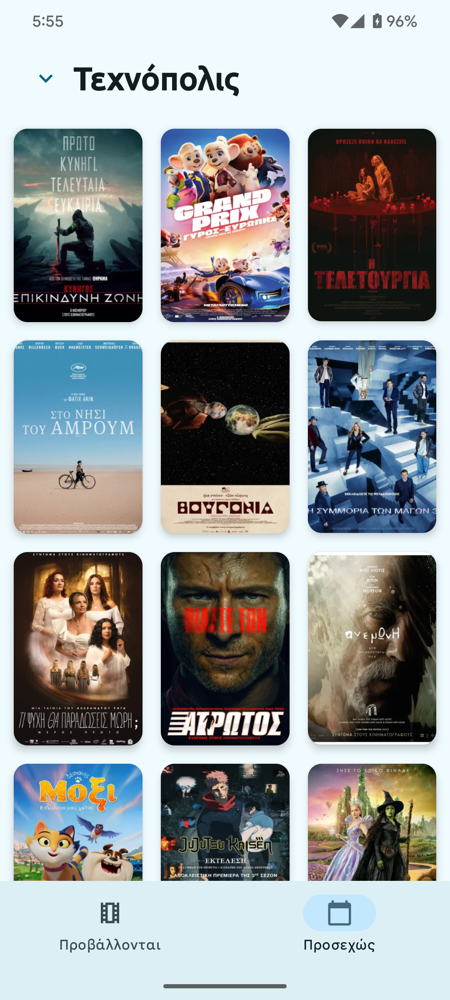
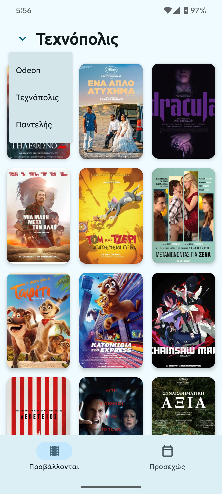
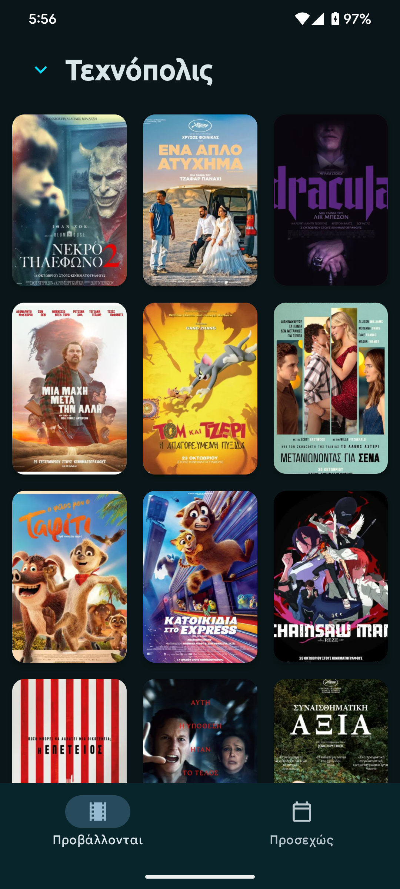
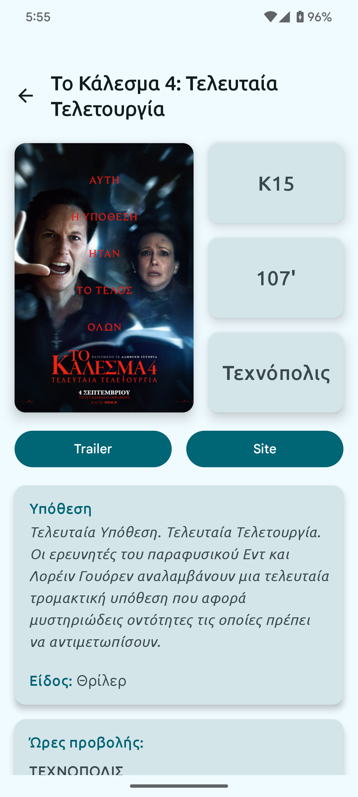
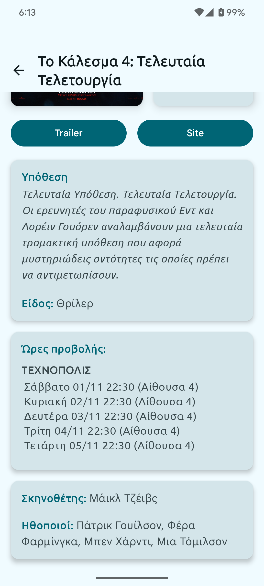

# CineCrete

CineCrete is an Android app built with Kotlin and Jetpack Compose that allows users to browse and explore movies currently playing in 3 cretan cinemas.
It shows info about the movies in clean and modern Material Design 3 interface.

## Features

- **Now Playing** - Browse current movies in theaters
- **Coming Soon** - Preview upcoming releases
- **Cinema Selection** - Choose your preferred cinema
- **Dark Mode** - Full dark mode support for comfortable viewing
- **Movie Details** - Comprehensive information and showtimes for each film

---

## Screenshots

### Light Mode Experience

| Now Playing | Upcoming Movies | Cinema Selection |
|:---:|:---:|:---:|
|  |  |  |

### Dark Mode Experience

*Seamless dark mode for late-night browsing*

### Movie Details & Showtimes

| Movie Information | Showtime Schedule |
|:---:|:---:|
|  |  |

*Complete movie details with available showtimes*

*Complete movie details with available showtimes*

